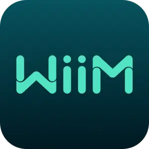

# ioBroker.wiim

**Tests:** 

## wiim adapter for ioBroker

adapter to access Wiim/Arylic and other devices based on the Linkplay streaming/multiroom technology

## supported devices
The adapter has been tested with:

	Wiim Amp
 	Wiim Mini
  	Arylic up2stream v3
   	Arylic S10+
	Audiocast M5
	August WR320B (after firmware upgrade to 4.6.415156.0)

Wiim devices use https communication, Arylic devices use http communication.
At least one feature (playPromptUrl) works only with Arylic devices with firmware >=4.6.415145 
Currently only the most important features of the API are implemented. Please let me know if other features are useful to you.

You can find information on the devices here:

WiiM: 		https://www.wiimhome.com/wiimvibelink/overview
Arylic:		https://www.arylic.com/
Audiocast:	https://audiocast.io/
			remark: Audicast M5 is sold under many different generic brands, I assume they all work with the adapter
August:		https://augustint.com/
			remark: the WR320B seems to be discontinued

## Adapter Configuration

	interval for refresh of player data in seconds: time between two requests for updated data

## Available States

		album: name of album played, string, read-only
				string that can be used to display the name of the current album, e.g.:
					"Electric"

		title: name if title played, string, read-only
				string that can be used to display the name of the current title, e.g.:
					"Wild Flower"

		artist: name of artist of title played, string, read-only
				string that can be used to display the name of the artist of the current title, e.g.:
					"The Cult"

		albumArtURI: URL of the cover art of the album played, string, read-only
				string that can be used to display the cover art of the current title, e.g.:
					"https://i.scdn.co/image/ab67616d0000b273ca8a324a5d0fce617bb2613d"
					Unfortunately, the generic Linkplay devices do not provide this information via http API....

		sampleRate: sample rate of file played, number, read-only
				number which can be used to display the current sample rate, e.g.;
					"44100"

		bitDepth: bit depth of file played, number, read-only
				number holdin the value of the current bit depth, e.g.:
					"16"

		Play_Pause: button to play/pause, button, read/write
				write "true" ti this datapoint to pause/play

		next: button to skip to the next title in playlist, button, read/write
				write "true" to this data point if you want to jump to the next title in the playlist

		previous: button to go to the previous title in playlist, button read/write
				write "true" to this data point if you want to jump to the previous title in the playlist

		lastRefresh: time stamp of last data poll from device, string, read-only, e.g.:
				"17:43:37"

		volume: playback volume, number, read/write
				use this datapoint to set the desired volume (0-100)

		play_preset: start playback of specific preset, number, write-only
				write the number of the preset you want to play to this datapoint

		play_URL: URL of file to be played, string, read/write
				the device will start to play the audio file/playlist located at the URL written to this datapoint

		loop_mode: current loop mode, number, read-only
				number between 1 and 4 indicating the current loop mode:
					0 - loop all
					1 - single loop
					2 - shuffle loop
					3 - shuffle, no loop
					4 - no shuffle, no loop

		toggle_loop_mode: skip to next loop mode, button, read-only
					not implemented yet

		setMaster: IP address of device to which this device shall be a slave within the sync group, read/write
					write the IP of the device controlling the sync group this device should join to this datapoint

		leaveSyncGroup: button to make device leave the current sync group, button, write
					write "true" to this datapoint in order to force the device leave the current snyc group
		
		jumptopos: position in ms to which the playback should jump, number, write-only
					write the position (in ms) to which playback should jump to this datapoint

		jumptopli: number of playlist item to which the playback should jump, number, write-only
					the device will jump to the index of the playlist xou write to this datapoint

		mode: current source, string, read-only, e.g.:
					"Spotify Connect"

		switchmode: source to which the device should switch, write-only
					

		playPromptUrl: URL of a file which should be played overlaying the current playback, string, write-only
					the device will play the file locate in the URL you write to this datapoint. The device will play the file in addtion to the current title. This can be used to implement a doorbell. After the "doorbell" is played the playback of the current track will return to the additional volume

		setShutdown: time in seconds until the device should shut down
					the device will shutdown after the number of seconds you write to this datapoint 

## Changelog

<### 0.3.0
* (KaiIOB) improved stability of bonjour autodetect of streamers, dnla introduced to retrieve coverArt from generic players>

<### 0.2.0
* (KaiIOB) introduction of bonjour auto-detect of streamers>

<### 0.1.0
* (KaiIOB) main functions implemented and code clean-up>

<### 0.0.3
* (KaiIOB) migration to setTimeout from setInteral>

<### 0.0.2
* (KaiIOB) Arylic devices added and corrections>

<### 0.0.1
* (KaiIOB) initial release>
<>
## License
MIT License

Copyright (c) 2025 KaiIOB <Kaibrendel@kabelmail.de>

Permission is hereby granted, free of charge, to any person obtaining a copy
of this software and associated documentation files (the "Software"), to deal
in the Software without restriction, including without limitation the rights
to use, copy, modify, merge, publish, distribute, sublicense, and/or sell
copies of the Software, and to permit persons to whom the Software is
furnished to do so, subject to the following conditions:

The above copyright notice and this permission notice shall be included in all
copies or substantial portions of the Software.

THE SOFTWARE IS PROVIDED "AS IS", WITHOUT WARRANTY OF ANY KIND, EXPRESS OR
IMPLIED, INCLUDING BUT NOT LIMITED TO THE WARRANTIES OF MERCHANTABILITY,
FITNESS FOR A PARTICULAR PURPOSE AND NONINFRINGEMENT. IN NO EVENT SHALL THE
AUTHORS OR COPYRIGHT HOLDERS BE LIABLE FOR ANY CLAIM, DAMAGES OR OTHER
LIABILITY, WHETHER IN AN ACTION OF CONTRACT, TORT OR OTHERWISE, ARISING FROM,
OUT OF OR IN CONNECTION WITH THE SOFTWARE OR THE USE OR OTHER DEALINGS IN THE
SOFTWARE.
