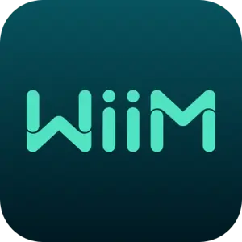

# ioBroker.wiim

**Tests:** 

## wiim adapter for ioBroker

adapter to access Wiim/Arylic and other devices based on the Linkplay streaming/multiroom technology

## supported devices
The adapter has been tested with:

	Wiim Amp
 	Wiim Mini
  	Arylic up2stream v3
   	Arylic S10+
	Audiocast M5
	August WR320B (after firmware upgrade to 4.6.415156.0)
	August WS350K
	Audio Pro Addon C5A
	Müzo Cobblestone

Wiim devices use https communication, Arylic devices use http communication.
At least one feature (playPromptUrl) works only with Arylic devices with firmware >=4.6.415145 
Currently only the most important features of the API are implemented. Please let me know if other features are useful to you.

You can find information on the devices here:

WiiM: 		https://www.wiimhome.com/wiimvibelink/overview
Arylic:		https://www.arylic.com/
Audiocast:	https://audiocast.io/
			remark: Audicast M5 is sold under many different generic brands, I assume they all work with the adapter
August:		https://augustint.com/
			remark: the WR320B seems to be discontinued

## Adapter Configuration

	interval for refresh of player data in seconds: time between two requests for updated data

## States & Control Channels

The adapter automatically creates states for each detected WiiM, Arylic, or Linkplay-based streaming device. The states are divided into read-only metadata and read/write control states.

### Metadata & Status (Read-Only)
These states represent the current playback information and hardware metrics fetched from the device.

| State ID | Type | Role | Unit | Description |
| :--- | :--- | :--- | :--- | :--- |
| `artist` | string | `media.artist` | - | Name of the currently playing artist. |
| `album` | string | `media.album` | - | Name of the current album. |
| `title` | string | `media.title` | - | Title of the current track. |
| `albumArtURI` | string | `media.cover` | - | HTTP URL or URI pointing to the album cover artwork. |
| `mode` | string | `text` | - | Current audio source mode (e.g., Bluetooth, Wi-Fi, Line-In). |
| `loop_mode` | number | `value` | - | Raw numeric loop/repeat mode returned by the hardware. |
| `sampleRate` | number | `value` | Hz | Audio sample rate of the currently playing stream (e.g., 44100). |
| `bitDepth` | number | `value` | bit | Audio bit depth of the stream (e.g., 16 or 24 bit). |
| `lastRefresh` | string | `date` | - | Timestamp of the last successful data refresh from the device. |

### Playback Controls (Read/Write)
Use these states to control the playback, routing, and system parameters of your streamers.

| State ID | Type | Role | Values / Range | Description |
| :--- | :--- | :--- | :--- | :--- |
| `Play_Pause` | boolean | `button` | trigger | Toggles between play and pause states. |
| `next` | boolean | `button` | trigger | Skips to the next track in the queue or playlist. |
| `previous` | boolean | `button` | trigger | Returns to the previous track. |
| `volume` | number | `level.volume` | `0` to `100` % | Controls the device master volume. |
| `loopmode` | number | `level` | `0` to `5` | Set selection dropdown for repeat and shuffle modes: `0`: Repeat all `1`: Repeat once `2`: Shuffle + Repeat `3`: Shuffle `4`: No repeat `5`: Shuffle + Repeat once |
| `jumptopos` | number | `level` | seconds | Seeks to a specific position (in seconds) within the current track. |
| `play_preset` | number | `button` | integer | Triggers a preset favorite slot pre-configured inside the WiiM/Arylic App. |
| `play_URL` | string | `text` | URL string | Plays a direct custom audio stream URL (e.g., HTTP raw mp3 link). |
| `playPromptUrl` | string | `text` | URL string | Plays an instant audio prompt or notification sound (e.g., for chimes/TTS). |
| `switchmode` | string | `text` | input mode | Manually changes the active input source channel. |
| `setShutdown` | number | `level` | minutes | Sets the integrated sleep timer (in minutes) after which the device turns off. |

### Multiroom & Synchronization (Read/Write)
Manage your device grouping and multiroom synchronous zones directly.

| State ID | Type | Role | Description |
| :--- | :--- | :--- | :--- |
| `setMaster` | string | `text` | Enter the target IP address to pair this player as a multiroom slave group member. |
| `leaveSyncGroup` | boolean | `button` | Triggers the device to leave its current multiroom sync group instantly. |
| `multiroom_slave_volume` | number | `level.volume` | Adjusts the relative volume offsets for active multiroom slave instances. |
| `multiroom_slave_mute` | boolean | `media.mute` | Mutes or unmutes all attached slave clients in the synchronized group. |
| `multiroom_kickout` | boolean | `button` | Kicks out a predefined device context from the active multiroom tree. |
 

## Changelog
### 0.5.0 (2026-02-22)
* First release with frequent auto-detection of new streamers in network

### 0.4.3 (2026-02-04)
* corrections based on test feedback, simplyfied streamer detection, simplified state subscription, state roles corrected, r/w of state correted

### 0.4.1
* (KaiIOB) minor correction

### 0.4.0
* (KaiIOB) reduced logging, introduction of player state, improved error handling, several devices added to list of tested devices

### 0.3.0
* (KaiIOB) improved stability of bonjour autodetect of streamers, dnla introduced to retrieve coverArt from generic players

### 0.2.0
* (KaiIOB) introduction of bonjour auto-detect of streamers

### 0.1.0
* (KaiIOB) main functions implemented and code clean-up

### 0.0.3
* (KaiIOB) migration to setTimeout from setInteral

### 0.0.2
* (KaiIOB) Arylic devices added and corrections

### 0.0.1
* (KaiIOB) initial release

For older releases, see [CHANGELOG_OLD.md](CHANGELOG_OLD.md).

## License
MIT License

Copyright (c) 2025-2026 KaiIOB <Kaibrendel@kabelmail.de>

Permission is hereby granted, free of charge, to any person obtaining a copy
of this software and associated documentation files (the "Software"), to deal
in the Software without restriction, including without limitation the rights
to use, copy, modify, merge, publish, distribute, sublicense, and/or sell
copies of the Software, and to permit persons to whom the Software is
furnished to do so, subject to the following conditions:

The above copyright notice and this permission notice shall be included in all
copies or substantial portions of the Software.

THE SOFTWARE IS PROVIDED "AS IS", WITHOUT WARRANTY OF ANY KIND, EXPRESS OR
IMPLIED, INCLUDING BUT NOT LIMITED TO THE WARRANTIES OF MERCHANTABILITY,
FITNESS FOR A PARTICULAR PURPOSE AND NONINFRINGEMENT. IN NO EVENT SHALL THE
AUTHORS OR COPYRIGHT HOLDERS BE LIABLE FOR ANY CLAIM, DAMAGES OR OTHER
LIABILITY, WHETHER IN AN ACTION OF CONTRACT, TORT OR OTHERWISE, ARISING FROM,
OUT OF OR IN CONNECTION WITH THE SOFTWARE OR THE USE OR OTHER DEALINGS IN THE
SOFTWARE.
